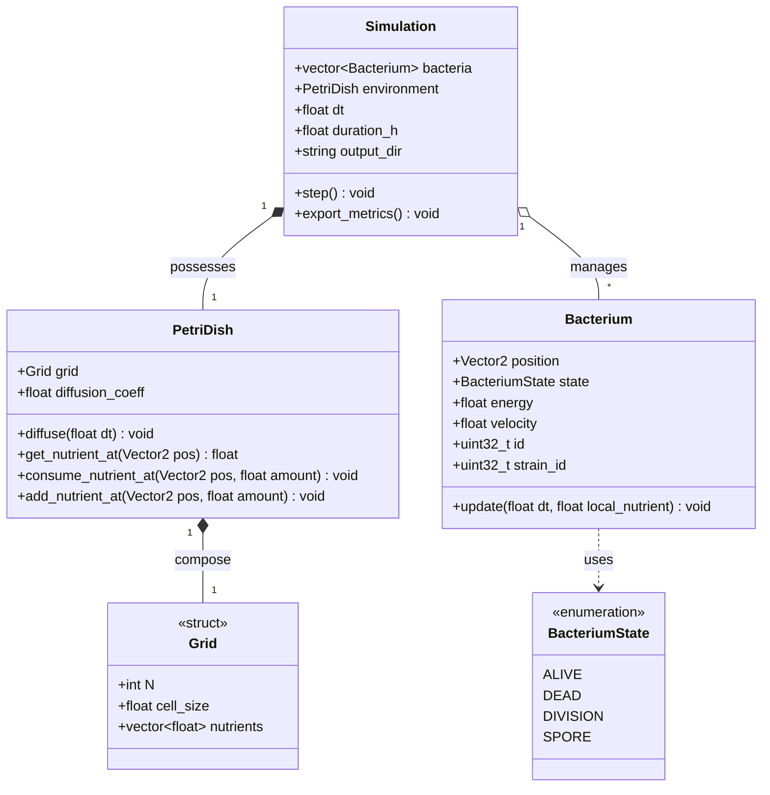
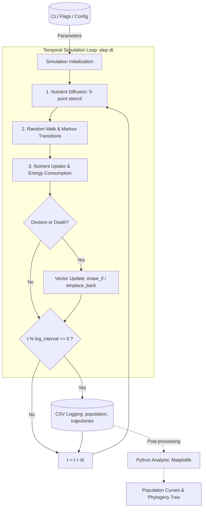

# BioChroma Pipeline and Architecture Description

> This document describes the system architecture, class relationships, and data pipeline of the project.

## Table of Contents
1. [Project Overview](#1-project-overview)
2. [Development Roadmap & Tasks](#2-development-roadmap--tasks)
3. [Architecture & Class Diagrams](#3-architecture--class-diagrams)
   - [3.1 Data Structures](#31-data-structures)
   - [3.2 Class Diagram](#32-class-diagram)
4. [Data Pipeline](#4-data-pipeline)
5. [Testing Strategy](#5-testing-strategy)

---

## 1. Project Overview

This project is developed as an exploratory C++ portfolio project focused on scientific computing and software design. The primary goal is to implement a stochastic multi-agent simulation of bacterial colonies within a virtual Petri dish using microscopic Markov chains.

Bacterial agents move, consume resources, undergo cell division, and interact locally. Their individual and collective evolution depends on:
- Nutrient availability across the continuous domain.
- Local population density (competition for resources and physical exclusion).
- Stochastic parameter mutations occurring during cell division.

Each bacterium is governed by an independent Markov process controlling state transitions (active, dividing, spore, or dead) and behavioral parameters (velocity, metabolic rate, chemotactic bias).

---

## 2. Development Roadmap & Tasks

### Milestone v0.1 — Headless Core Engine & CSV Output (~10 h)
- [ ] Set up CMake build system and repository structure.
- [ ] Implement `Types.hpp` (`Vector2`, `BacteriumState`).
- [ ] Implement `Grid` struct and continuous-to-discrete spatial mapping.
- [ ] Implement 2D finite-difference diffusion solver for nutrients.
- [ ] Implement `Bacterium` agent (random walk step, metabolism, state transitions).
- [ ] Implement `Simulation` loop orchestrator and periodic CSV export.
- [ ] Write initial unit tests in `tests/test_grid.cpp`.
- [ ] (Write Python validation script (`plot_population.py`) to verify conservation laws.)

### Milestone v0.2 — Lightweight Raylib Viewport (~5 h)
- [ ] Integrate Raylib dependency in build configuration.
- [ ] Implement real-time 2D canvas drawing (nutrient heatmap + colored agent circles).
- [ ] Add interactive input controls (mouse click to seed nutrients/bacteria, spacebar pause).

### Milestone v0.3 — Collective Dynamics & Local Competition (~8 h)
- [ ] Implement cell division (binary fission with energy threshold).
- [ ] Implement local neighbor querying (spatial binning) for crowding/starvation effects.
- [ ] Add continuous nutrient replenishment / flow dynamics.

### Milestone v0.4 — Stochastic Mutations & Phylogeny (~6 h)
- [ ] Introduce Gaussian perturbation on strain parameters during division.
- [ ] Assign and track strain identifiers (`strain_id`, parent links).
- [ ] Export `phylogeny.csv` and generate genealogical tree graphs with Python.

---

## 3. Architecture & Class Diagrams

### 3.1 Data Structures

```cpp
#pragma once
#include <vector>
#include <cstdint>

// Fundamental 2D continuous vector
struct Vector2 {
    float x = 0.0f;
    float y = 0.0f;
};

// Internal states of a bacterium
enum class BacteriumState : uint8_t {
    ALIVE,      // Active agent: moves, feeds, metabolizes
    DEAD,       // Inactive agent scheduled for cleanup
    DIVISION,   // Undergoing binary fission
    SPORE       // Dormant state under severe nutrient scarcity
};

// 2D discrete environment grid (contiguous 1D buffer)
struct Grid {
    int N = 100;                    // Grid dimensions (N x N cells)
    float cell_size = 1.0f;         // Spatial size of a cell in world units
    std::vector<float> nutrients;   // Linearized nutrient buffer (size N * N)
};
```

### 3.2 Class Diagram



---

## 4. Data Pipeline



---

## 5. Testing Strategy

The `tests/` directory hosts modular test suites executed via the build system:
- **`test_grid.cpp`**: Validates coordinate mapping boundary conditions and tests conservation of mass during the 5-point stencil diffusion pass.
- **`test_bacterium.cpp`**: Validates Markov state transitions and energy decay under starved conditions.
- **`test_simulation.cpp`**: Verifies that bacteria collection cleanup (`std::erase_if`) executes without memory corruption or iterator invalidation.