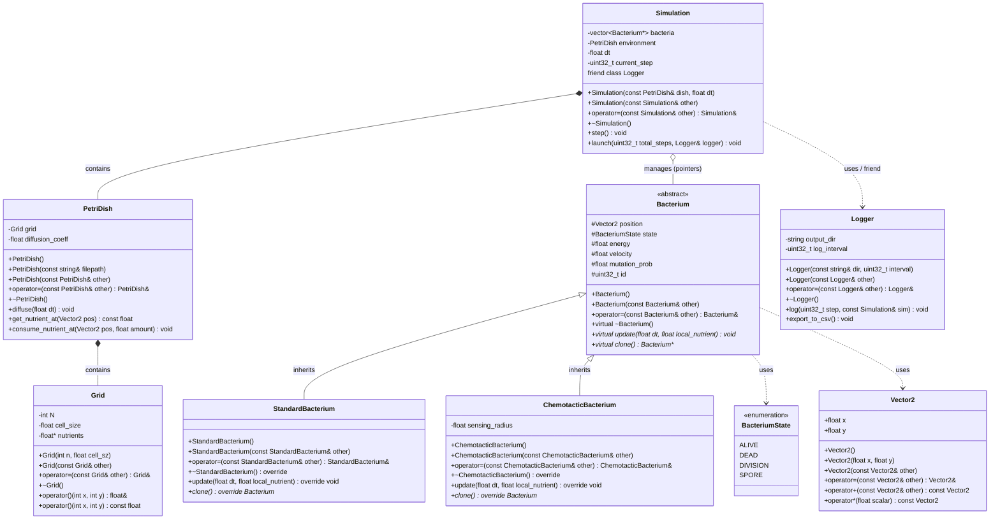
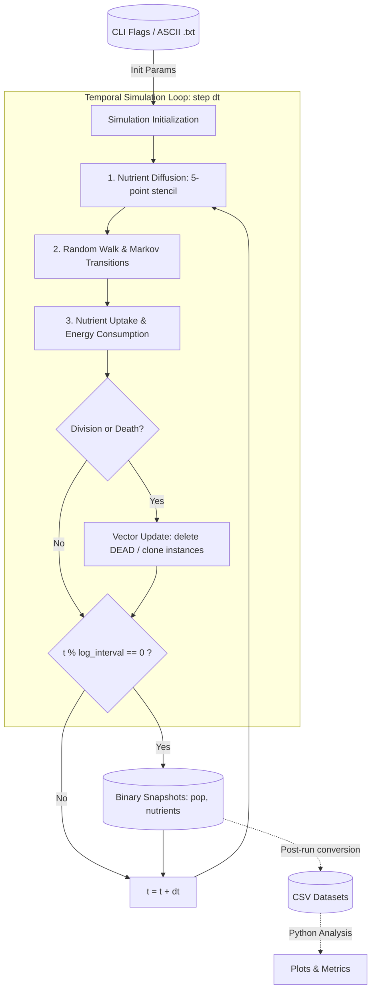

# BioChroma Pipeline and Architecture Description

> This document describes the system architecture, class relationships, and data pipeline of the project.

## Table of Contents
- [BioChroma Pipeline and Architecture Description](#biochroma-pipeline-and-architecture-description)
  - [Table of Contents](#table-of-contents)
  - [1. Project Overview](#1-project-overview)
  - [2. Architecture \& Class Diagrams](#2-architecture--class-diagrams)
    - [2.1 Data Structures](#21-data-structures)
    - [2.2 Class Diagram](#22-class-diagram)
  - [3. Data Pipeline](#3-data-pipeline)

---

## 1. Project Overview

This project is developed as an exploratory C++ portfolio project focused on scientific computing and software design. The primary goal is to implement complex Markov chain processes for multiple bacteria simulation in a virtual Petri dish.

Bacterial agents move, consume resources, undergo cell division, and interact locally. Their individual and collective evolution depends on:
- Nutrient availability across the continuous domain.
- Local population density (competition for resources and physical exclusion).
- Stochastic parameter mutations occurring during cell division.

Each bacterium is governed by an independent Markov process controlling state transitions (active, dividing, spore, or dead) and behavioral parameters (velocity, metabolic rate, chemotactic bias).

---

## 2. Architecture & Class Diagrams

Here are presented all the structures and classes used in the project.

### 2.1 Data Structures

**Cell States.** First, we need to define some basic structures. `BacteriumState` defines the current state of a `Bacterium` object: `DIVISION` means that the cell is dividing itself into two parts to produce two clones, and `SPORE` is an available state for `StandardBacterium` objects reached when nearby resources are too low.

**The Grid.** The Petri dish is modeled by an $N \times N$ discrete grid stored in a dynamically allocated `float` array. This grid represents the local concentration of nutrients (e.g. normalized values between `0.0` and `9.0`). It can be initialized from an ASCII `.txt` configuration file where the user specifies bacteria (`=` or `+`), obstacles (`#`), or nutrient levels (`[0-9]`).

> **NOTE**: The `Bacterium` objects are not stored inside the grid cells, but inside a flat `std::vector` within the `Simulation` orchestrator. Bacterial positions are represented in a continuous 2D space ($\mathbb{R}^2$) using `Vector2`.

```cpp
#pragma once
#include <cstdint>

// Internal states of a bacterium
enum class BacteriumState : uint8_t {
    ALIVE,      // Active agent: moves, feeds, metabolizes
    DEAD,       // Inactive agent scheduled for cleanup
    DIVISION,   // Undergoing binary fission
    SPORE       // Dormant state under severe nutrient scarcity
};

// 2D discrete environment grid (contiguous dynamically allocated buffer)
struct Grid {
    int N = 100;                    // Grid dimensions (N x N cells)
    float cell_size = 1.0f;         // Spatial size of a cell in world units
    float* nutrients = nullptr;     // Linearized nutrient buffer (size N * N)
};
```

### 2.2 Class Diagram

**Simulation Objects.** Below are represented all the simulation classes and their inheritance and usage relationships. The main class is `Simulation`, which orchestrates the simulation steps, holding the environment `PetriDish` and managing all polymorphic `Bacterium` instances.

**Bacterium Types.** Two concrete `Bacterium` child classes are implemented:
- `StandardBacterium`: A basic bacterium walking randomly on the continuous domain, capable of entering a `SPORE` dormant state when local nutrient concentrations drop below a critical threshold.
- `ChemotacticBacterium`: Cannot enter spore state, but moves along the local nutrient gradient (chemotaxis) with higher motility.



---

## 3. Data Pipeline

The simulation runs through a discrete-time execution pipeline:
1. **Initialization**: The initial environment state is parsed from the ASCII file via `PetriDish(filepath)` and seeded with polymorphic `Bacterium` pointers within `Simulation` (driven by the `main()` CLI entry point).
2. **Temporal Step** (`Simulation::step()`):
2.1 **Diffusion**: The 2D finite-difference diffusion stencil updates nutrient distribution across `Grid` via `PetriDish::diffuse(dt)`.
2.2 **Agent Updates**: For each bacterium in bacteria, polymorphic behavior is triggered via `b->update(dt, local_nutrient)`. Motility, nutrient intake, and Markov state transitions are executed.
2.3 **Fission**: Bacteria in `DIVISION` state trigger `b->clone()`, inserting new instances into the collection.
2.4 **Population Cleanup**: Inactive instances marked as `DEAD` are freed and erased from the pointer vector.
3. **Telemetry & Output**: The `Logger` streams compact binary snapshots during computation and exports processed `CSV` datasets upon completion for external analysis.

