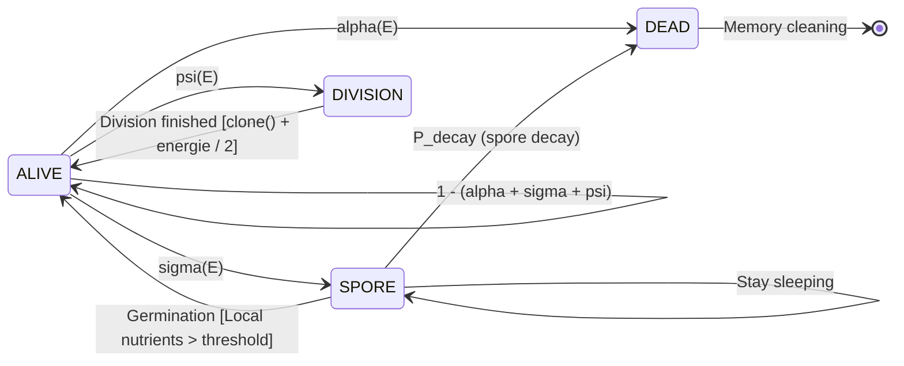

# Some Mathematics 

> This file presents and develops all the necessary mathematics to understand the project. 

## Table of Contents
- [Some Mathematics](#some-mathematics)
  - [Table of Contents](#table-of-contents)
  - [1. Diffusion on the nutrient grid](#1-diffusion-on-the-nutrient-grid)
    - [1.1 The global formula](#11-the-global-formula)
    - [1.2 Solving it : the Euler method](#12-solving-it--the-euler-method)
  - [2. Markov's Transitions](#2-markovs-transitions)

---

## 1. Diffusion on the nutrient grid

**The core idea.** As implemented in the `include/Grid.h` and `src/Grid.cpp`, the grid is represented as a simple 2d array stored in a 1d `float` one. To perform this, we use a simple formula which allows us to cast any 2d coordinate into a 1d one : 
$$ (x,y) \in N \times N \iff i = y \times N + x \in [0, N \times N]. $$

### 1.1 The global formula 

**Diffusion.** At each step, we perform a *diffusion* operation on the grid: each discrete `Grid` cell shares a bit of its nutrients to the near ones. To perform that, we use the Fick's laws. 

**Fick's Laws.** Those physics laws describes the diffusion process of particles in discrete fields: it's perfect in our case. Here is the general formula: 

$$ 
\frac{\partial u}{\partial t} = D \nabla^{2} u = D \cdot \left( \frac{\partial^2 u}{\partial x^2} + \frac{\partial^2 u}{\partial y^2}\right). 
$$

with $D$ the *diffusion coefficient* which describes the amount of nutrients that the local cell $u$ share with the others. 

### 1.2 Solving it : the Euler method

**Laplacian.** In our case, we are on a discrete `N` times `N` grid of `cell_size` times `cell_size` cells. We approximate the above general formula with a simple 5-points Laplacian tencil: 

$$ 
\nabla^2 u_{i,j} \simeq \frac{
    u_{i+1,j} + u_{i-1, j} + u_{i, j-1} + u_{i, j+1} - 4 u_{i,j}
}{\Delta x^2}. 
$$

**Euler.** Next a simple Euler explicit writing allows us to process it on a computer : 

$$ 
u_{i,j}^{t+1} = u_{i,j}^t + \Delta t \cdot D \cdot \left( \frac{u_{i+1,j} + u_{i-1, j} + u_{i, j-1} + u_{i, j+1} - 4 u_{i,j}
}{\Delta x^2}
\right). 
$$

Let $ \alpha = \frac{D \cdot \Delta t}{\nabla x^2}$, then we have : 

$$
u_{i,j}^{t+1} = u_{i,j}^t + \alpha \left( u_{neighbours}^t - 4 u_{i,j}^t \right). 
$$

**The $\alpha$.** This coefficient represents the amount of nutriments the current cell give to the others around it. To prevent divergence, we need to have $ \alpha \leqslant 0.25$. To make it more comprehensive for the user, we asked him to give a `diffusion_coeff` $d \in [0,1]$ at the initilization which will represent the same thing that $\alpha$. Then, we just init an `alpha` parameter using the identity: 
$$ \alpha = 0.25 \times d. $$

--- 

## 2. Markov's Transitions 

Here is described the transition process between states and cells for a Bacterium on the PetriDish (i.e the grid). 

**Representation.** As shown is [`docs/ARCHITECTURE.md`](./ARCHITECTURE.md) a `Bacterium` is represented by differents *attributes* : 
- its `position` as a `Vector2`, 
- its `state` as a `BacteriumState` (`ALIVE`, `DEAD`, `SPORE` or `DIVISION`), 
- its `energy` between 0 (dead) and 10, 
- its `velocity` $\in [0.1, 1.0]$ $\mathrm{mm} \cdot \mathrm{s}^{-1}$ knowing that $1 \; \mathrm{cell} \simeq 1 \; \mathrm{mm}$, 
- its `mutation_prob` (in $[0, 1]$), 
- its `id`. 

**Transitions.** At each simulation step, the bacterium can change its state with a certain probability depending on its `energy` level : 

Where : 
$$ 
    \alpha(E) = 1 - \frac{E}{10}, \quad \
    \psi(E) = 
        \begin{cases}
            0 & \text{if } E \leqslant 5 \\
            p_{max} \cdot \left( \frac{E - 5}{5} \right)^2 & \text{else}
        \end{cases}
$$

$$
    \sigma(E) = 
        \begin{cases}
            s_{max} \cdot \frac{E}{2} & \text{if } 0 \leqslant E < 2 \\ 
            s_{max} \cdot \frac{5 - E}{3} & \text{if } 2 \leqslant E \leqslant 5 \\ 
            0 & \text{if } E > 5 
        \end{cases}
$$
with $s_{max} = 0.5$ and $p_{max} = 0.8$. Thus, the probability to stay in `ALIVE` state is $1 - (\alpha(E) + \sigma(E) + \psi(E))$. 

**Moving.** After the state transition, if the `Bacterium` remains in `ALIVE` state, it can move on the `Grid`. To perform that, we implement a *random walk* on it depending on its `velocity`. Here is the position update formula : 
$$
    r^{t + \Delta t} = r^t + 
    \begin{pmatrix}
        v \cdot \Delta t \cdot \cos \theta \\ 
        v \cdot \Delta t \cdot \sin \theta
    \end{pmatrix}
    \quad \text{with } 
    \theta \sim \mathcal{U}([0, 2\pi]).
$$