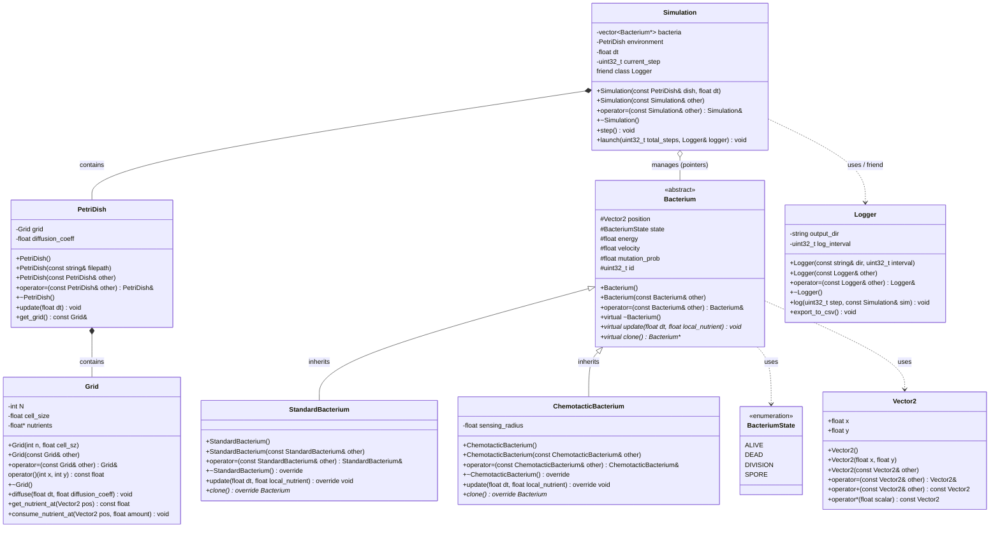

# BioChroma : Simulation bactérienne en milieu fermé

**Étudiant :** Axel Pigeon  
**Formation :** Master Interactions des Mathématiques et de l'Informatique pour l'IA (IMA)

**Date :** 24 septembre 2026  
**Dépôt :** [Dépôt GitHub](https://github.com/axelp-dev/BioChroma)

---

## 1. Présentation générale

**Motivation**. Intéressé par la modélisation stochastique, j'ai cherché un projet mettant en commun l'efficacité du langage C++ et la simulation aléatoire. J'ai donc opté pour une simulation d'une marche aléatoire multi-agents sur une surface finie en 2D. 

**Généralités**. *BioChroma* est un simulateur stochastique modélisant l'évolution d'une population de *bactéries* (agents) dans une *boîte de Pétri* (milieu). L'objectif est d'implémenter différents types de bactéries (héritage) permettant la mise en place d'interractions (prédateur/proies) entre les différents agents. 

**Principaux Objets.** Chaque agent est modélisé par un objet autonome régi par des transitions markoviennes entre différents états (actif, en division, spore ou mort) en fonction de son niveau d'*énergie* et des *ressources* disponibles. 
La boîte de pétri est modélisée par une grille 2D où chaque *cellule* contient une certaine quantité de *nutriments* (ressources). À chaque étape de la simulation, une étape de *diffusion* des ressources dans le milieu est opérée avant la mise à jour de chaque agent. 

**Interface.** *BioChroma* est pensé pour être un outil simple sans interface graphique poussée. L'initialisation de la grille se fera par le remplissage d'un tableau dans un fichier `.txt`. Pendant la simulation un affichage ASCII sera produit en ligne de commande. Enfin, un module d'exportation au format CSV sera disponible pour effectuer des analyses plus poussées sur la trajectoire de la simulation. Un exécutable en ligne de commande `kallisto` sera développé pour instancier la simulation. 

---

## 2. Objectifs techniques

Ici sont décrits quelques détails techniques relatifs à l'implémentation du projet en C++ ainsi qu'aux attendus techniques de celui-ci. 

* **Gestion dynamique de la mémoire :**  
  La grille de nutriments (`Grid`) encapsule un buffer contigu alloué dynamiquement sur le tas (`float* nutrients` via `new[]` et `delete[]`). Les opérations relatives à la gestion mémoire seront respectées (constructeur, destructeur, copie profonde et surcharge d'opérateur). 

* **Hiérarchie de classes et polymorphisme :**  
  Une classe de base abstraite `Bacterium` déclare des méthodes virtuelles pures (`update`, `clone`) et un destructeur virtuel. Deux sous-classes concrètes spécialisent le comportement des agents :
  * `StandardBacterium` : marche aléatoire isotrope, métabolisme de base et mise en état de dormance (`SPORE`) en cas de famine locale.
  * `ChemotacticBacterium` : déplacement orienté par le gradient local de nutriments (chimiotactisme) avec une mobilité accrue.

* **Orchestration et sémantique d'accès :**  
  La classe `Simulation` gère le cycle de vie d'une collection hétérogène via des pointeurs polymorphes (`std::vector<Bacterium*>`). Les surcharges d'opérateurs sont exploitées pour les types d'algèbre 2D (`Vector2`). 

* **Chaîne de compilation et tests :**  
  Un `Makefile` complet gère la compilation séparée en C++. Un module de test sera aussi développé et branché sur le `Makefile` via un `make test`. 

---

## 3. Architecture globale

